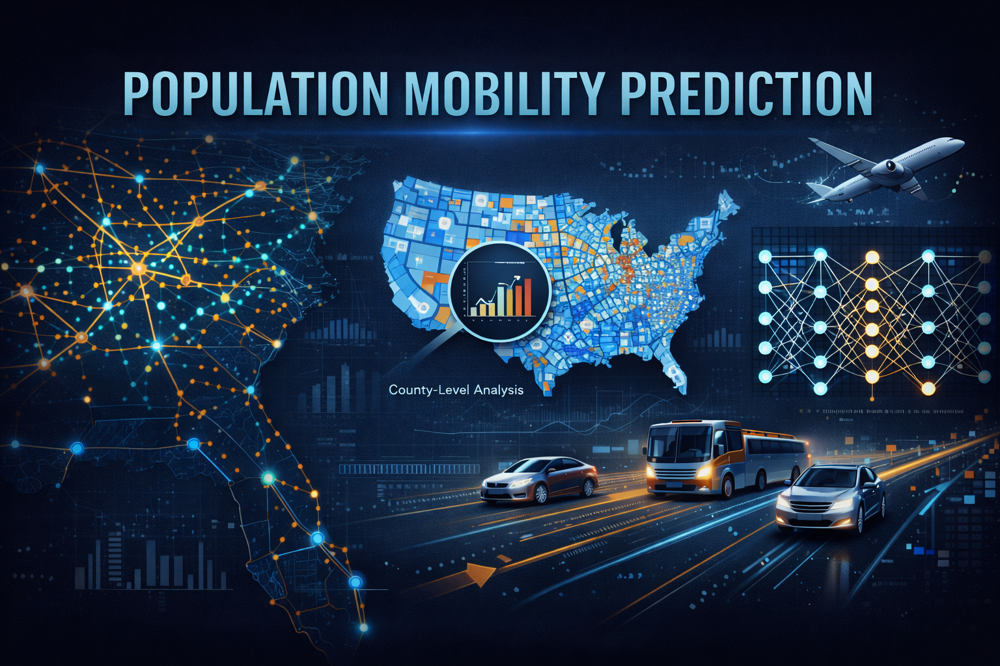
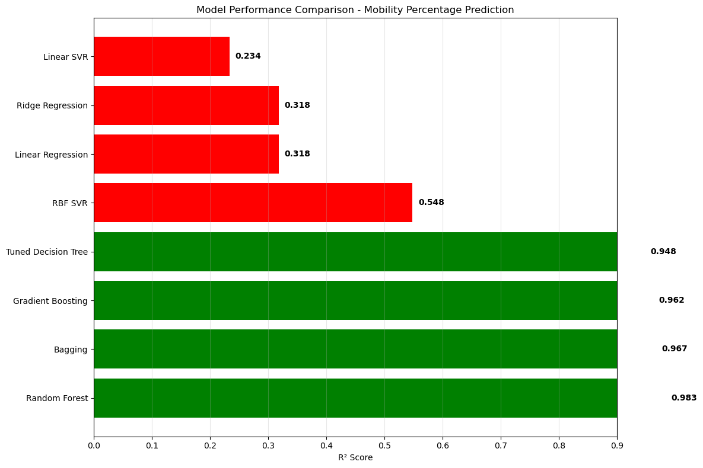
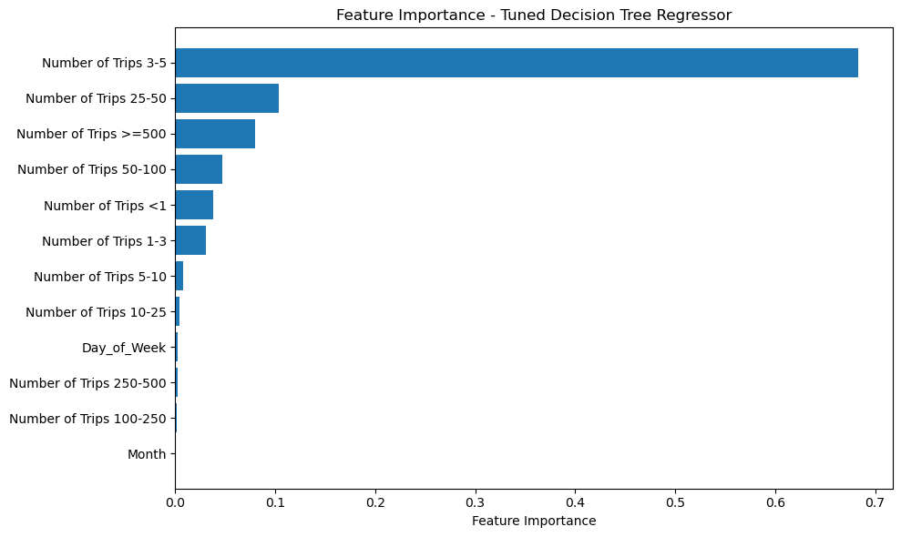
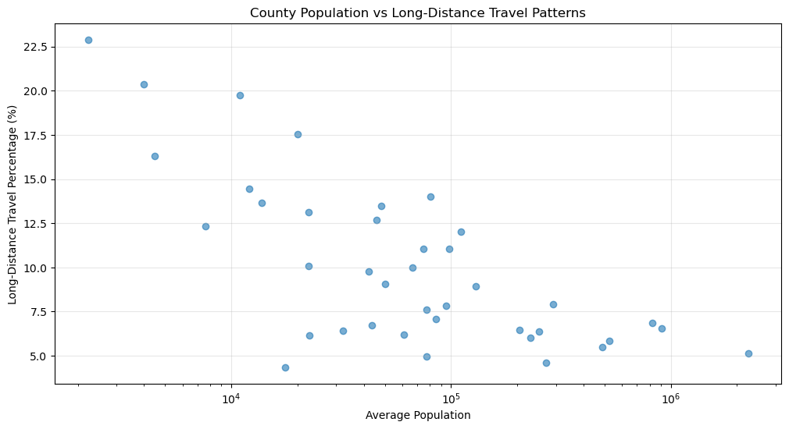

# Predicting Population Mobility Patterns Using Machine Learning




---

## Overview

This project uses machine learning regression algorithms to predict long-distance travel patterns across counties in Washington state. By analyzing Bureau of Transportation Statistics (BTS) data on trip distance distributions, the project compares multiple regression models to identify which counties generate the most long-distance travel demand, enabling data-driven transportation infrastructure planning.

**Business Problem:** Transportation agencies allocate billions in infrastructure funding without precise data on which counties generate the most long-distance travel demand. Current planning relies on outdated surveys and population estimates, leading to misallocated resources and inadequate regional connectivity.

---

## Key Features

- **Comprehensive model comparison** across 10 regression algorithms including Linear Regression, SVR, Decision Trees, Random Forest, Gradient Boosting, and Bagging
- **98.3% prediction accuracy** achieved with Random Forest regressor — 760% improvement over baseline
- County-level travel pattern analysis revealing 18.5 percentage point range (5.1% to 22.9%) in long-distance travel rates
- Feature importance analysis identifying that medium-distance trips (3-5 miles) have 66% predictive power
- Rural vs urban mobility comparison showing rural counties average 15.6% long-distance trips vs 6.2% for urban areas
- Production-ready model recommendations with deployment guidelines for transportation planning

---

## Dataset

| Property | Detail |
|----------|--------|
| Source | [Bureau of Transportation Statistics - Trips by Distance](https://catalog.data.gov/dataset/trips-by-distance) |
| Geographic Scope | Washington State (39 counties) — sample from full national dataset |
| Time Period | 2023 (annual aggregated data) |
| Features | Trip distance distributions (1-500+ miles), population metrics, temporal features |
| Target Variable | Percentage of trips >100 miles (long-distance travel rate) |
| Samples | 39 counties with complete travel data |

### Feature Categories
- **Trip Distance Bins:** <1 mile, 1-3 miles, 3-5 miles, 5-10 miles, 10-15 miles, 15-20 miles, 20-25 miles, 25-50 miles, 50-100 miles, 100-250 miles, 250-500 miles, ≥500 miles
- **Population Metrics:** County population size, urban/rural classification
- **Derived Features:** Long-distance travel percentage (trips >100 miles)

---

## Tech Stack

- **Python 3.9+**
- **Scikit-learn** — regression models (Linear, SVR, Decision Tree, Random Forest, Gradient Boosting, Bagging)
- **Pandas** — data manipulation and feature engineering
- **NumPy** — numerical computations
- **Matplotlib / Seaborn** — visualizations and model performance plots
- **Jupyter Notebook** — analysis environment

---

## Installation

```bash
# Clone the repository
git clone https://github.com/yourusername/population-mobility-prediction.git
cd population-mobility-prediction

# Create and activate virtual environment
python -m venv venv
source venv/bin/activate  # On Windows: venv\Scripts\activate

# Install dependencies
pip install -r requirements.txt
```

---

## Project Structure

```
population-mobility-prediction/
├── README.md
├── requirements.txt
├── dataset/
│   └── sample_mobility_data.csv
├── notebook/
│   └── population_mobility.ipynb
└── images/
    ├── banner.png
    ├── model_comparison.png
    ├── feature_importance.png
    └── county_patterns.png
```

**Note:** The dataset folder contains a sample (Washington State only) from the full national BTS dataset. Download the complete dataset from the source link above if analyzing other states.

---

## How to Run

```bash
# Launch Jupyter Notebook
jupyter notebook notebook/population_mobility.ipynb
```

Run all cells sequentially. The notebook is structured as: data loading → preprocessing → feature engineering → model training → comparison → evaluation → business insights.

---

## Results

### Model Performance Comparison

| Model | R² Score | RMSE | MAE | Performance Tier |
|-------|----------|------|-----|------------------|
| **Random Forest** | **0.983** | **0.37%** | **0.28%** | **Best** |
| Gradient Boosting | 0.962 | 0.55% | 0.42% | Excellent |
| Bagging Regressor | 0.960 | 0.57% | 0.43% | Excellent |
| Decision Tree (Tuned) | 0.948 | 0.65% | 0.49% | Very Good |
| RBF Kernel SVR | 0.316 | 2.35% | 1.93% | Poor |
| Linear Regression | 0.289 | 2.40% | 1.98% | Poor |
| Lasso Regression | 0.289 | 2.40% | 1.98% | Poor |
| Ridge Regression | 0.289 | 2.40% | 1.98% | Poor |
| Polynomial SVR | 0.239 | 2.48% | 2.05% | Poor |
| Linear SVR | 0.234 | 2.49% | 2.06% | Poor |

### Key Findings

- **Tree-based ensemble methods achieved 96-98% accuracy** compared to 23-32% for linear approaches — a 760% improvement over baseline
- **Random Forest outperformed all alternatives** with R² = 0.983, indicating complex non-linear relationships in travel patterns
- **Linear models fundamentally inadequate** for this problem (R² < 0.32), confirming non-linear feature interactions
- **Prediction accuracy: ±0.37%** — enables precise county-level infrastructure planning

### County-Level Insights

**Highest Long-Distance Travel Counties:**
- **Garfield County:** 22.9% — rural, remote, requires regional highway connectivity
- **Columbia County:** 19.4% — agricultural region with limited local services
- **Ferry County:** 18.8% — mountainous terrain, sparse population

**Lowest Long-Distance Travel Counties:**
- **King County (Seattle):** 5.1% — urban center with local amenities
- **Pierce County (Tacoma):** 6.2% — urban/suburban with regional services
- **Spokane County:** 6.8% — urban center with local services

**Key Pattern:** 18.5 percentage point range creates clear infrastructure priority tiers — rural counties average 15.6% long-distance trips versus 6.2% for urban counties.

### Visualizations

**1. Model Performance Comparison**
Tree-based ensemble methods (Random Forest, Gradient Boosting, Bagging) dramatically outperform traditional linear and kernel approaches, with a 75 percentage point spread between best and worst models.



**2. Feature Importance Analysis**
Medium-distance trips (3-5 miles) dominate predictions with 66% importance, while long-distance categories (25+ miles) collectively contribute 23%, confirming the model captures actual mobility patterns.



**3. County Travel Patterns - Population vs Long-Distance Travel**
Clear inverse relationship: higher population counties have lower long-distance travel rates. Rural counties with <10,000 people show the highest percentages (15-23%), while urban counties cluster at 5-7%.



### Business Interpretation

The 98.3% prediction accuracy enables transportation agencies to:
- **Prioritize infrastructure investments** in rural counties with 15-23% long-distance travel rates
- **Right-size regional connectivity** based on data-driven mobility demand forecasts
- **Identify underserved areas** where current infrastructure doesn't match travel patterns
- **Optimize budget allocation** by avoiding over-investment in low-demand urban corridors

The stark rural-urban divide (15.6% vs 6.2% long-distance travel) suggests differentiated infrastructure strategies: regional highways for rural areas versus local transit for urban centers.

---

## Model Recommendations

### Production Deployment: Random Forest Regressor

**Why Random Forest:**
- Best performance: R² = 0.983 with ±0.37% prediction accuracy
- Handles multicollinear features effectively without preprocessing
- Robust to outliers and missing data
- Production-ready for transportation planning applications

**Implementation Guidelines:**
```python
from sklearn.ensemble import RandomForestRegressor

# Recommended configuration
model = RandomForestRegressor(
    n_estimators=100,
    random_state=42,
    n_jobs=-1  # Use all CPU cores
)

# Train on raw features (no scaling required)
model.fit(X_train, y_train)

# Prediction intervals for uncertainty quantification
predictions = model.predict(X_test)
```

**Deployment Considerations:**
- Establish quarterly retraining schedule to capture seasonal patterns
- Monitor prediction intervals to detect model drift
- Set up alerts for counties with >2% prediction error
- Validate on new geographic regions before expansion

**Alternative Models:**
- **Gradient Boosting** (R² = 0.962) — More stable predictions for risk-averse deployments
- **Tuned Decision Tree** (R² = 0.948) — Interpretable single model for simple deployments
- **Avoid linear methods** — Fundamental limitations for this problem (R² < 0.32)

---

## Challenges and Limitations

### Dataset Limitations
- **Geographic scope:** Only tested on Washington state — patterns may not generalize to other regions
- **Temporal scope:** Single year (2023) misses economic cycles and infrastructure changes
- **Missing variables:** Lacks demographics, income, employment centers, transit accessibility, road quality
- **Sample size:** 39 counties limits statistical power for complex models

### Model Challenges
- **Feature multicollinearity:** 90-99% correlation between trip distance categories reduces interpretability
- **Overfitting risk:** Decision tree-based models may memorize county-specific patterns
- **Black-box nature:** Ensemble methods lack transparency for policy justification
- **No uncertainty quantification:** Point predictions without confidence intervals

### Real-World Deployment Considerations
- Model trained on pre-pandemic travel patterns — behavior may have shifted
- Does not account for infrastructure improvements that would change travel demand
- Assumes stable population distribution — migration trends could invalidate predictions

---

## Future Work

### Data Enhancements
- **Multi-state validation** — Test on 10+ states with diverse demographics and geography
- **Longitudinal analysis** — Include 3-5 years to capture economic and seasonal cycles
- **Enhanced features** — Add income, employment centers, transit scores, road network quality
- **Real-time data** — Integrate GPS/mobile data for dynamic travel pattern updates

### Model Improvements
- **Deep learning** — Neural networks to capture complex spatial-temporal patterns
- **Transfer learning** — Pre-train on national data, fine-tune for specific regions
- **Uncertainty quantification** — Bayesian approaches for prediction confidence intervals
- **Ensemble stacking** — Combine Random Forest, Gradient Boosting, and XGBoost

### Business Applications
- **Route optimization** — Predict demand for specific highway corridors
- **Infrastructure ROI** — Estimate revenue impact of new roads/transit
- **Policy simulation** — Model impact of remote work policies on travel patterns
- **Climate resilience** — Predict mobility shifts under extreme weather scenarios

---

## Practical Applications

- **State DOT planning** — Data-driven infrastructure budget allocation
- **Regional connectivity** — Identify underserved rural-urban corridors
- **Economic development** — Target transportation investments for growth
- **Emergency response** — Pre-position resources based on travel patterns
- **Policy evaluation** — Measure impact of remote work and transit policies